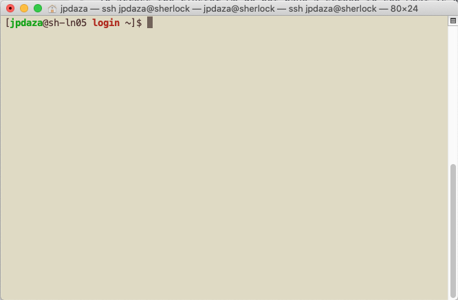

# Matlab in the Stanford clusters
## Goal
 The goal of this class is to demistify the use of the cluster, and to enable you not only to use Matlab in the computer cluster but any program you may want.
## Cluster?
A cluster of computers is just several powerful computers connected together that can work all at once in a problem. In most cases, just one of the computers will work for you, as is the case with Matlab, this does not mean is not as powerful, one of those computers called a **Node** can have 32 processors working for you. They do not have screens attached, which makes interacting with them different than what we are used to, *this is where most of the mystery behing their use come from*.
The Cluster of computers is usually located in a cold room, some Stanford clusters are located in SLAC, and we don't have to go there to use them.
## How do I use a Cluster?
If they are far away how do I use them? In most cases we communicate with a cluster using **text** (over the internet), simple text commands and text files, basically code.

Think of using a cluster as the Matlab interface, we have a command window for simple commands like `x=linspace(0,1,10)`, and we create text files like `someMatlabScript.m` to run more instructions.

You have been learning Matlab all this time and you learned the basic commands in the first class. Now to use a cluster you have to learn the cluster language, but just a handful of commands will get you ready to use it. Keep in mind we have simple commands and text files.

## 1. UNIX
Clusters have their own "language", which is the operating system used to run them which complies with UNIX standard. In our case Mac computers and Linux computers all adhere to the UNIX standard. This in a small part means that we can interact with our computer via text through a **Terminal** window, which in most computers is a program that looks:


Once opened the program looks like this:



The terminal window can be customized to fit your needs.(For more info go to [zshell customized](https://github.com/ohmyzsh/ohmyzsh) or ask me.) Increase text size, change colors, use autocomplete etc...

The terminal is just a screen where we type text and tell the computer what to do, we can use it locally on a Linux or Mac machine, and through it we can connect to another computers and use them, in our case, the cluster. To get a good introduction to using the terminal go to
[Unix1 Shell Intro](https://swcarpentry.github.io/shell-novice/).

## 2. Matlab from the Terminal
The terminal is just another way of using our computer, we can run Matlab, though we will not get the nice user interface. Let's create a folder, run Matlab from that folder, create a simple script and run it:

1. `ls`: Lists the files and folders in the current directory.
1. `pwd`: Tells me the current directory. In case you where wondering.
1. `mkdir MatlabFromTerminal`: Creates a folder called `MatlabFromTerminal`.
1. `cd MatlabFromTerminal`: Goes into that folder.
1. `matlab -nodesktop -nosplash`: **Warning: This might not work**
 1. If not working type `/Ap`, then hit `tab`.
 1. Should autocomplete to `/Applications/`
 1. Type `MAT` after the autocompleted text and hit `tab`. Should autocomplete to `/Applications/MATLAB_R2019a.app/`
 1. Hit `tab` this should show you several folders, type `b` hit `tab`, this should autocomplete to `/Applications/MATLAB_R2019a.app/bin/`
 1. Then hit `tab`, finally `matlab` is there, type `mat` hit `tab` it should autocomplete to `/Applications/MATLAB_R2019a.app/bin/matlab`.
 1. Add the options from above `/Applications/MATLAB_R2019a.app/bin/matlab - nodesktop -nosplash`, hit `RETURN/ENTER`. This should open matlab command prompt in the terminal.
 **Note:** `Tab` usually autocompletes some text for you, the previous steps just showed that. In most computers Matlab might not work straight away, you have to look for it as we have just done.
 1. We have Matlab open, you can now use it as always. The **Editor** window is missing now is time for you to learn how to create text files from the terminal.

## 3. Creating Matlab scripts from the terminal
We now need a simple text editor, we will use `nano` in this class. If you pretend to use the terminal often I recommend you learn VIM, here is a nice tutorial.

Here I recommend you open another terminal window, so you have Matlab in one window and the script in another one:

In the new window type `nano matlabScript.m`.

This opens a small text editor, here we will write a simple script, save it and run it. The script is the following:

```
x=linspace(0,1,100);
y=sin(3*pi*x);
plot(x,y)
print('sine.png','-dpng')
```

In the lower part of `nano`, `^` stands for the `Ctrl` key. Lets hit `Ctrl`+`X`, this closes `nano` and asks us if we want to save the file. Type `y` and hit enter twice. We have saved a new text file which is our script.

To check that our file is indeed correct type `cat matlabScript.m`, `cat` is a program that prints the content of a text file.  

In the window where Matlab is open type matlabScript, it should run.
GREAT! You have now used Matlab from the terminal, created a script and run it. Which is what we need to use Matlab in the cluster.

One last step, let's quit Matlab, in the Matlab command type `quit`.

There is another way that we have to learn to run Matlab, most of the times you will send a script to the cluster and tell it to run. It won't be that much interactive.

Type `rm sine.png`: This removes the picture we saved. `rm` is a program that removes files, once removed they are lost forever(technically no, but the files will not go to the recycle bin)

You can hit the `up` arrow to look for previous commands you typed, look for the one that opened Matlab:

`/Applications/MATLAB_R2019a.app/bin/matlab -nodesktop -nosplash`

Now change the line to:

`/Applications/MATLAB_R2019a.app/bin/matlab -batch "matlabScript"`

Hit enter, this will open Matlab run the script and close Matlab. The figure we printed out will be there. This will be a usual line to run Matlab in the cluster.

## 4. Logging in the Cluster
At Stanford we have several clusters, some of the are:
* **FarmShare**: This is available to all students.
* **Sherlock**: This one is for research, you have to request an account with the approval of an advisor.
* **Mazama**: This is the Earth sciences cluster, it is for research only, you have to request an account.

I asked for Mazama for the class as we are all earth sciences, but they said Research only. We will use **FarmShare**, to log in in the cluster we will use a program called `ssh`, which stands for secure shell.

```shell
ssh SUID@rice.stanford.edu
```
We have logged in, it does not look much different than the terminal we used before. We can use all the commands we used before, but for Matlab we have to do something else.

## 5. Opening Matlab in the Clusters

Matlab is not loaded by default in the remote machines, we have to tell the machine to load it.

`module load matlab`

Will load Matlab in the computer we logged in, `module load` will load many other programs that you might want to use.

To open Matlab we simply write:

`matlab`

And everything else is just as we practice in our local machine.

## 6. Exercise

Repeat what we did in our local machine, you might want to use two windows to log in on `rice`, one for Matlab and the other one for editing text.

1. Write the script.
2. Open Matlab and run the script.
3. Run the script without opening Matlab.

So far this way of using the cluster is just to run small tests to see if everything is working.

If you ever log into Mazama or Sherlock, you should never run software, you have logged on the Head node, which is the computer that manages the cluster. You give a set of instructions to the Head node and he will choose where to run your code. Let's see how to do that.

## 7. Sending a Job to the Cluster

We have to create a text file with instructions that tell the Head node what we want to do, open VI or nano and create the following file, give it a name.

To open and create the file type:

`nano matlabJob.sh`

The `.sh` means that is code that should run in the shell/terminal. The contents of the file should be the following. This are just instructions that let the head Node know what are your computer needs and the code you want to execute.

```
#!/bin/bash -l
#SBATCH -J SUID_job
#SBATCH -N 1
#SBATCH -c 2
#SBATCH -t 00:00:10
#SBATCH -o output.txt
#SBATCH -e errors.txt
#SBATCH --mail-type=ALL
#SBATCH --mail-user=SUID

module load matlab
matlab -batch "matlabScript"
```

Close and save the file. We are now ready to send a job to the cluster, to send a job we just type:

`sbatch matlabJob.sh`

This sends our job to the cluster. To see how our job is doing we type:

`squeue`

You will see the jobs other persons are submitting, we have a name for our job. So lets filter it.

`squeue --name SUID_job`

These are the basics to submit a job to the cluster.
